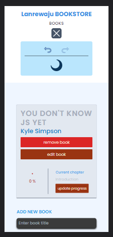

# MY BOOK-STORE

> This is an electronic book-store app with CRUD features and an undo with redo feature built with Vite, React and TailwindCSS.



## Built With

- Vite

- React
  - JSX
  - Forms Library
  - React Router
  - createPortal for Modal
  - Hooks
    - useState
    - useEffect
    - useSelector
    - useDispatch
    - useRef

- Redux
  - Redux-undo

- Tailwind CSS
  - DaisyUi plugin

- Tests
  - Vitest
  - React Testing Library
  - Happy-DOM
  - Redux Mock-store
  - Redux thunk

## Live Demo

[Live Demo Link](https://lanr3-bookstore.netlify.app/)

### Development (Running locally)

- Clone the project

```bash
git clone https://github.com/Lanr3waju/my-bookstore.git

```

- Install Dependencies

```bash
npm install
```

To automatically fix eslint issues found (where possible):

```bash
npm run lint
```

## 👤 Author

- Github: [@Lanr3waju](https://github.com/Lanr3waju>)
- LinkedIn: [@Abass Olanrewaju](https://www.linkedin.com/in/lanr3waju/)

## 🤝 Contributing

Contributions, issues and feature requests are welcome!

Feel free to check the [issues page](../../issues).

## Show your support

Give a ⭐️ if you like this project!

## Acknowledgments and Resources used

- [Icons8](https://icons8.com/)
- [daisyUI](https://daisyui.com/)

## 📝 License

[MIT licensed](./LICENSE).
